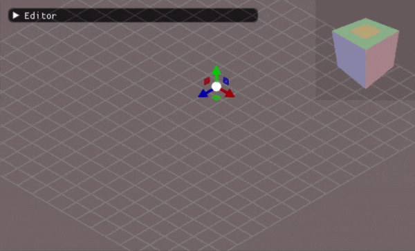
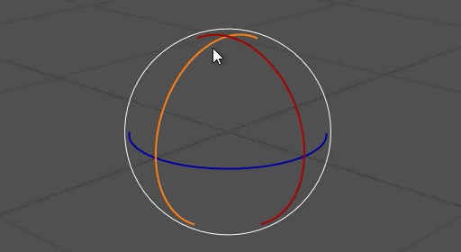
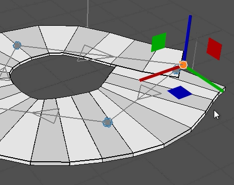
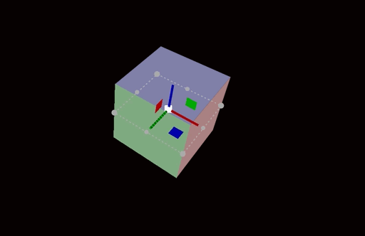
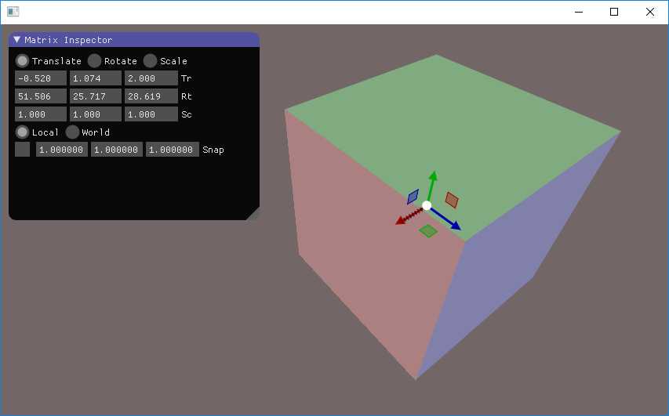
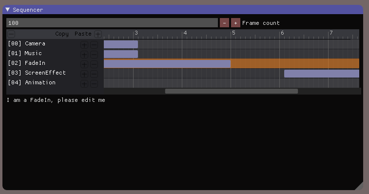
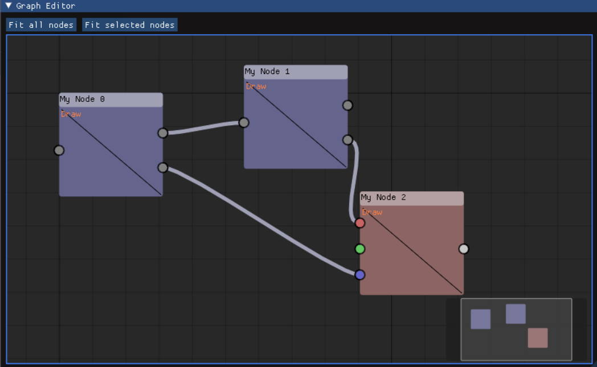
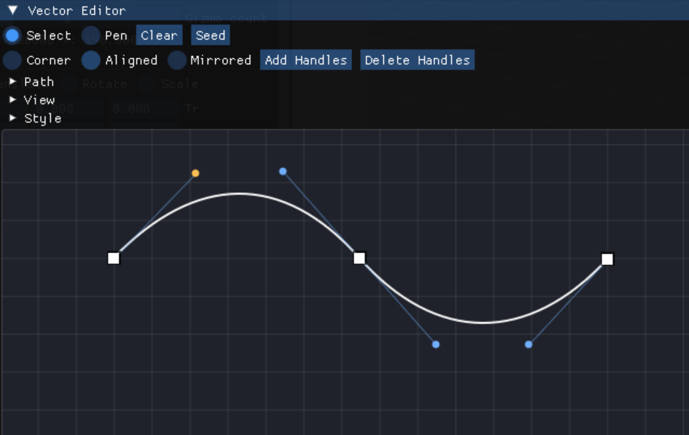

# ImGuizmo

[](https://github.com/CedricGuillemet/ImGuizmo/actions/workflows/build.yml)
[](https://github.com/CedricGuillemet/ImGuizmo/actions/workflows/build.yml)
[](https://github.com/CedricGuillemet/ImGuizmo/actions/workflows/build.yml)
[](https://github.com/CedricGuillemet/ImGuizmo/actions/workflows/build.yml)

A collection of [Dear ImGui](https://github.com/ocornut/imgui) widgets for 3D manipulation and more.

For API reference and usage examples, see the [documentation](docs/documentation.md).

## Widgets

Each widget is a standalone `.h`/`.cpp` pair that can be used independently. A unified static library containing all components is also available via the provided CMake build.

### ImViewGizmo

Manipulate view orientation with a single line of code.



### ImGuizmo

A small library built on top of Dear ImGui that allows you to manipulate 4x4 float matrices (rotation, translation, and scale). Designed with the Immediate Mode philosophy in mind and has no additional dependencies.







### ImSequencer

A timeline sequencer for editing frame start/end ranges across multiple events.



### GraphEditor

A node graph editor with connections and a delegate system for custom rendering inside nodes.



### ImVectorEditor

A path editor widget for 2D vector geometry. Supports a pen tool, anchor and handle editing, open and closed paths, and host-provided transforms that compose with ImGuizmo object manipulation.



## Install

ImGuizmo can be installed via [vcpkg](https://github.com/microsoft/vcpkg):

```bash
vcpkg install imguizmo
```

See the [vcpkg example](vcpkg-example/) for more details.

## License

ImGuizmo is licensed under the MIT License. See [LICENSE](LICENSE) for more information.
