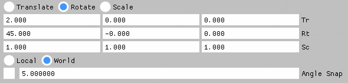

# ImGuizmo API Documentation

## Table of Contents

- [Getting Started](#getting-started)
- [Core Functions](#core-functions)
- [Matrix Helpers](#matrix-helpers)
- [Debug](#debug)
- [Gizmo Manipulation](#gizmo-manipulation)
- [Usage Example](#usage-example)

---

## Getting Started

Call `BeginFrame` once per frame, right after `ImGui_XXXX_NewFrame()`:

```cpp
ImGuizmo::BeginFrame();
```

---

## Core Functions

### IsOver

Returns `true` if the mouse cursor is over any gizmo control (axis, plane, or screen component).

```cpp
bool IsOver();
```

### IsUsing

Returns `true` if the mouse is over the gizmo or if the gizmo is currently being moved.

```cpp
bool IsUsing();
```

### Enable

Enables or disables the gizmo. The state persists until the next call to `Enable`. When disabled, the gizmo is rendered with a semi-transparent gray color.

```cpp
void Enable(bool enable);
```

---

## Matrix Helpers

Helper functions for manually editing translation, rotation, and scale using float inputs.
Each parameter (`translation`, `rotation`, `scale`) points to an array of 3 floats.
Angles are in degrees.

```cpp
void DecomposeMatrixToComponents(const float* matrix, float* translation, float* rotation, float* scale);
void RecomposeMatrixFromComponents(const float* translation, const float* rotation, const float* scale, float* matrix);
```

> **Note:** These functions have some numerical stability limitations. Use with caution.

**Example:**

```cpp
float matrixTranslation[3], matrixRotation[3], matrixScale[3];
ImGuizmo::DecomposeMatrixToComponents(gizmoMatrix.m16, matrixTranslation, matrixRotation, matrixScale);
ImGui::InputFloat3("Tr", matrixTranslation, 3);
ImGui::InputFloat3("Rt", matrixRotation, 3);
ImGui::InputFloat3("Sc", matrixScale, 3);
ImGuizmo::RecomposeMatrixFromComponents(matrixTranslation, matrixRotation, matrixScale, gizmoMatrix.m16);
```

---

## Debug

### DrawCube

Renders a cube with face colors corresponding to face normals. Useful for debugging and testing.

```cpp
void DrawCube(const float* view, const float* projection, float* matrix);
```

---

## Gizmo Manipulation

### Manipulate

Draws and handles a gizmo for the given matrix. Requires view and projection matrices.

The `matrix` parameter is both input and output: it defines where the gizmo is drawn and is updated when the user interacts with it. `deltaMatrix` is optional and receives the incremental transform. `snap` points to a `float[3]` for translation snapping, or a single `float` for rotation or scale snapping. Snap angles are in degrees.

```cpp
enum OPERATION
{
    TRANSLATE,
    ROTATE,
    SCALE
};

enum MODE
{
    LOCAL,
    WORLD
};

void Manipulate(const float* view, const float* projection, OPERATION operation, MODE mode,
                float* matrix, float* deltaMatrix = 0, float* snap = 0);
```

---

## Usage Example



```cpp
void EditTransform(float* cameraView, float* cameraProjection, float* matrix)
{
    static ImGuizmo::OPERATION mCurrentGizmoOperation(ImGuizmo::ROTATE);
    static ImGuizmo::MODE mCurrentGizmoMode(ImGuizmo::WORLD);
    if (ImGui::IsKeyPressed(ImGuiKey_T))
        mCurrentGizmoOperation = ImGuizmo::TRANSLATE;
    if (ImGui::IsKeyPressed(ImGuiKey_E))
        mCurrentGizmoOperation = ImGuizmo::ROTATE;
    if (ImGui::IsKeyPressed(ImGuiKey_R))
        mCurrentGizmoOperation = ImGuizmo::SCALE;
    if (ImGui::RadioButton("Translate", mCurrentGizmoOperation == ImGuizmo::TRANSLATE))
        mCurrentGizmoOperation = ImGuizmo::TRANSLATE;
    ImGui::SameLine();
    if (ImGui::RadioButton("Rotate", mCurrentGizmoOperation == ImGuizmo::ROTATE))
        mCurrentGizmoOperation = ImGuizmo::ROTATE;
    ImGui::SameLine();
    if (ImGui::RadioButton("Scale", mCurrentGizmoOperation == ImGuizmo::SCALE))
        mCurrentGizmoOperation = ImGuizmo::SCALE;
    float matrixTranslation[3], matrixRotation[3], matrixScale[3];
    ImGuizmo::DecomposeMatrixToComponents(matrix, matrixTranslation, matrixRotation, matrixScale);
    ImGui::InputFloat3("Tr", matrixTranslation);
    ImGui::InputFloat3("Rt", matrixRotation);
    ImGui::InputFloat3("Sc", matrixScale);
    ImGuizmo::RecomposeMatrixFromComponents(matrixTranslation, matrixRotation, matrixScale, matrix);

    if (mCurrentGizmoOperation != ImGuizmo::SCALE)
    {
        if (ImGui::RadioButton("Local", mCurrentGizmoMode == ImGuizmo::LOCAL))
            mCurrentGizmoMode = ImGuizmo::LOCAL;
        ImGui::SameLine();
        if (ImGui::RadioButton("World", mCurrentGizmoMode == ImGuizmo::WORLD))
            mCurrentGizmoMode = ImGuizmo::WORLD;
    }
    static bool useSnap(false);
    if (ImGui::IsKeyPressed(ImGuiKey_S))
        useSnap = !useSnap;
    ImGui::Checkbox("##useSnap", &useSnap);
    ImGui::SameLine();
    vec_t snap;
    switch (mCurrentGizmoOperation)
    {
    case ImGuizmo::TRANSLATE:
        snap = config.mSnapTranslation;
        ImGui::InputFloat3("Snap", &snap.x);
        break;
    case ImGuizmo::ROTATE:
        snap = config.mSnapRotation;
        ImGui::InputFloat("Angle Snap", &snap.x);
        break;
    case ImGuizmo::SCALE:
        snap = config.mSnapScale;
        ImGui::InputFloat("Scale Snap", &snap.x);
        break;
    default:
        break;
    }
    ImGuiIO& io = ImGui::GetIO();
    ImGuizmo::SetRect(0, 0, io.DisplaySize.x, io.DisplaySize.y);
    ImGuizmo::Manipulate(cameraView, cameraProjection, mCurrentGizmoOperation,
                         mCurrentGizmoMode, matrix, NULL, useSnap ? &snap.x : NULL);
}
```
